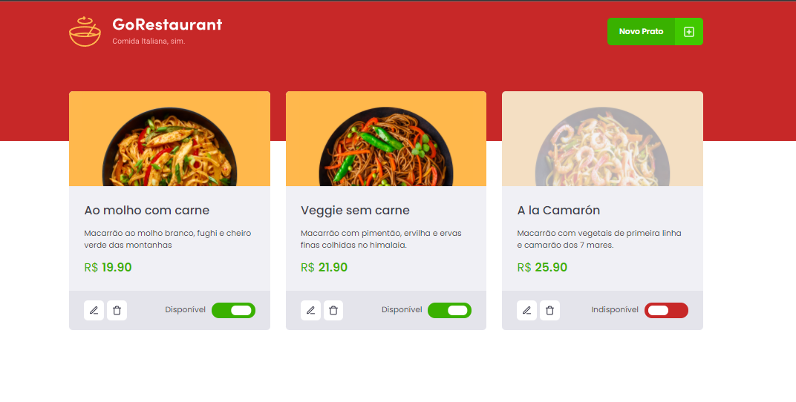
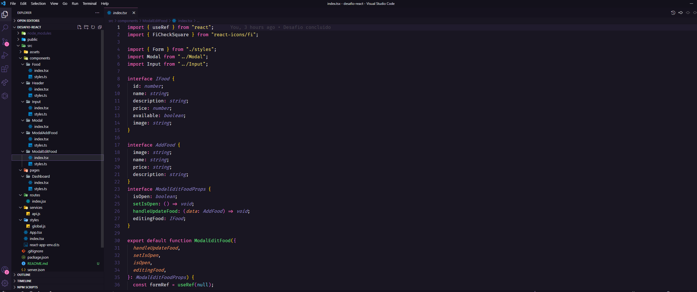

<h1 align="center">GoRestaurant</h1>

  
  

  <a href="#-tecnologias">Tecnologias</a>&nbsp;&nbsp;&nbsp;|&nbsp;&nbsp;&nbsp;
  <a href="#-como-executar">Como executar</a>&nbsp;&nbsp;&nbsp;|&nbsp;&nbsp;&nbsp;
  <a href="#-Sobre">Sobre</a>&nbsp;&nbsp;&nbsp;|&nbsp;&nbsp;&nbsp;
  <a href="#-Projeto">Projeto</a>&nbsp;&nbsp;&nbsp;|&nbsp;&nbsp;&nbsp;
  <a href="#-Licença">Licença</a>

  
  

## ✨ Tecnologias

Esse projeto foi desenvolvido com as seguintes tecnologias:

- [React-js](https://pt-br.reactjs.org/)
- [TypeScript](https://www.typescriptlang.org/)
- [styled-components](https://styled-components.com/)
- [react-router-dom](https://www.npmjs.com/package/react-router-dom)
- [json-server](https://www.npmjs.com/package/json-server)
- [react-modal](https://github.com/reactjs/react-modal)
- [react-icons](https://react-icons.github.io/react-icons/)
- [unform](https://unform.dev/)

---

## 🚀 Como executar

- Clone o repositório e acesse a pasta;
- Instale as dependências com `yarn`;

- Inicie o servidor com Json-server `yarn server`;
 - A aplicação pode ser acessada em [`localhost:4000`](http://localhost:3333).

- Inicie o servidor com `yarn dev`;

A aplicação pode ser acessada em [`localhost:3000`](http://localhost:3000).

---

## 📄 Sobre

Nesse desafio, eu deveria migrar uma aplicação de Javascript e Class Components para Typescript e Function Components

---

## 📄 Projeto

Este projeto foi um clonado da plataforma Rocketseat do Ignite - ReactJS
- [Rocketseat - Ignite Ch-02 - Desafio React -Desafio: Refactoring de classes e TypeScript](https://github.com/rocketseat-education/ignite-template-reactjs-refactoring-classes-ts)

---
## 📄 Licença

Esse projeto está sob a licença MIT. Veja o arquivo [LICENSE](LICENSE) para mais detalhes.

---